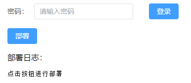
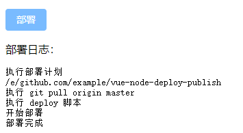

# 自动化部署

## 目录结构

```
├── bin # 命令行工具命令
│   ├── start.js # zuodeploy start 执行入口
│   └── zuodeploy.js # zuodeploy 命令入口，在 package.json 的 bin 属性中配置
├── docImages # README.md 文档图片 
├── frontend # 客户端页面/前端操作页面（koa-static 静态服务指定目录）
│   └── index.html # Vue + ElementUI + axios + socket.io
├── server # 服务端
│   ├── utils
│   │   ├── logger.js # log4js 
│   │   └── runCmd.js # node child_process spawn（执行 shell 脚本、pm2 服务开启）
│   └── index.js # 主服务（koa 接口、静态服务 + socket + 执行 shell 脚本）
├── .eslintrc.cjs # eslint 配置文件 + prettier
├── args.json # 用于 pm2 改造后，跨文件传递端口、密码参数
├── CHANGELOG.md # release 版本功能迭代记录
├── deploy-master.sh # 用于测试，当前目录开启服务偶，点击部署按钮，执行该脚本
├── index.js # zuodeploy start 执行文件，用于执行 pm2 start server/index.js 主服务 
├── package.json # 项目描述文件，npm 包名、版本号、cli 命令名称、
├── publish.sh # npm publish（npm包） 发布脚本
└── README.md # 使用文档
```
## 前后端技术栈、相关依赖

- 前端/客户端
    - vue3: 框架
    - axios: 数据请求工具
    - element-plus: vue3组件库
- 服务端
    - node: 技术栈
    - socket.io: socket 服务端
    - koa: 静态服务运行容器
    - koa-static: 静态服务器
    - koa-router: 路由
    - koa-session: 用于接口鉴权，防止他人获取到部署接口后疯狂请求部署
    - koa-bodyParser: 解析 post 请求参数
    - log4js: 带时间戳的 log 输出
    - pm2: 以后台方式静默执行
    - prompts: 参照 vue-create，引导用户输入端口、密码
    - commander: 用于生成的命令 deploy 运行时帮助文档、提示，deploy start 执行入口

## 显示效果

> 未登录



> 已登录


> 部署



## 封装成一个npm包cli工具

为什么封装成 npm 包，使用命令行工具开启服务。主要是简单易用，如果不使用命令行工具形式，需要三步：

- 先下载代码到服务器
- npm install
- node index.js 或者 pm2 start index.js -n xxx 开启服务

改成 npm 包命令行工具形式只需要下面两步，而且更节省时间

- npm install zuo-deploy pm2 -g
- 运行 zuodeploy start 会自动使用 pm2 开启服务

创建一个 npm 包并上传到 npm 官方库步骤：

- 需要有 npm 账号，如果没有可以到 [www.npmjs.com](www.npmjs.com) 注册一个
- 创建一个文件夹，用于存放 npm 包内容，比如 npmPackage
- 在该目录下，运行 npm init 初始化一个 package.json，输入的 name 就是 npm 包名
    - 包名有两种形式，普通包 vue-cli，作用域包 @vue/cli，区别参见 npm 包前面加@是什么意思 [(vue-cli 与 @vue/cli 的区别)](http://www.zuo11.com/blog/2020/7/npm_scope.html)
- 一般默认入口为 index.js，暴露出一个变量、一个方法

```js
module.exports = {
  name: '写一个npm包',
  doSomething() {
    console.log('这个npm暴露一个方法')
  }
}
```

这样就可以直接发布了，创建一个 publish 脚本，并执行（linux 下 chmod +x publish.sh;./publish.sh;）

```bash
# publish.sh
npm config set registry=https://registry.npmjs.org
npm login # 登陆 ，如果有 OTP, 邮箱会接收到验证码，输入即可
# 登录成功后，短时间内会保存状态，可以直接 npm pubish
npm publish # 可能会提示名称已存在，换个名字，获取使用作用域包（@xxx/xxx）
npm config set registry=https://registry.npm.taobao.org # 还原淘宝镜像
```

到 npmjs.org 搜索对应包就可以看到了

使用该 npm 包，创建 testNpm/index.js

```js
const packageInfo = require('zuoxiaobai-test')

console.log(packageInfo) 
packageInfo.doSomething()
```
在 testNpm 目录下 npm init 初始化 package.json，再 npm install zuoxiaobai-test --save; 再 node index.js，执行情况如下图，调用 npm 包正常

这样我们就知道怎么写一个 npm 包，并上传到 npm 官方库了。

怎么在 npm 包中集成 cli 命令。举个例子：在 npm install @vue/cli -g 后，会在环境变量中添加一个 vue 命令。使用 vue create xx 可初始化一个项目。一般这种形式就是 cli 工具。

一般在 package.json 中有一个 bin 属性，用于创建该 npm 包的自定义命令

```json
// package.json
"bin": {
    "zuodeploy": "./bin/zuodeploy.js"
}
```

上的配置意思是：全局安装 npm install xx -g 后，生成 zuodeploy 命令，运行该命令时，会执行 bin/zuodeploy.js

本地开发时，配置好后，在当前目录下运行 sudo npm link 即可将 zuodeploy 命令链接到本地的环境变量里。任何 terminal 里面运行 zuodeploy 都会执行当前项目下的这个文件。解除可以使用 npm unlink

一般 cli 都会使用 commander 来生成帮助文档，管理指令逻辑，代码如下

```js
// bin/zuodeploy.js
#!/usr/bin/env node

const { program } = require("commander");
const prompts = require("prompts");

program.version(require("../package.json").version);

program
  .command("start")
  .description("开启部署监听服务") // description + action 可防止查找 command拼接文件
  .action(async () => {
    const args = await prompts([
      {
        type: "number",
        name: "port",
        initial: 7777,
        message: "请指定部署服务监听端口：",
        validate: (value) =>
          value !== "" && (value < 3000 || value > 10000)
            ? `端口号必须在 3000 - 10000 之间`
            : true,
      },
      {
        type: "password",
        name: "password",
        initial: "888888",
        message: "请设置登录密码（默认：888888）",
        validate: (value) => (value.length < 6 ? `密码需要 6 位以上` : true),
      },
    ]);
    require("./start")(args); // args 为 { port: 7777, password: '888888' }
  });

program.parse();

```

使用 commander 可以快速管理、生成帮助文档，分配具体指令的执行逻辑

上面的代码中，指定了 start 指令，zuodeploy start 执行时会先通过 prompts 以询问的方式搜集参数，再执行 bin/start.js

在 start.js 中，我么可以将 server/index.js 的代码全部拷贝过去即可完成 zuodeploy start 开启服务，点击部署的功能

## 稳定性提高-pm2改造

为了提升稳定性，我们可以在 start.js 中以代码的方式执行 pm2 src/index.js 这样服务更稳定可靠，另外可以再加入 log4js 输出带时间戳的 log，这样有利于排查问题。

